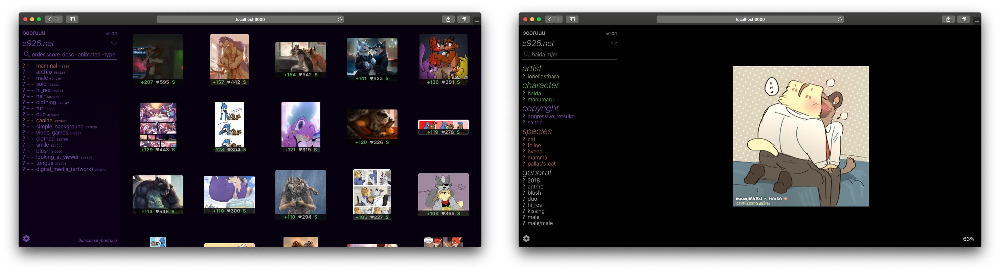

# booruuu - a browser-based imageboard browser

## Warning: This project is a personal project, and is not aimed for general use, although this may change in the future.

This is an imageboard (booru) browser that runs on the browser. Eliminates annoyances that are frequent when using imageboards, such as advertisements, ugly interfaces, intentional throttling, etc...

This is personal project mainly aimed for learning React, but it is possible that it becomes a general-purpose tool if there's enough interest.

This is still in alpha stage, so bugs are pretty common; always except things to not work.



I have beginner-level knowledge in development, thus the code might not be on par with what you might be used to. English is not my mother tongue, so you might also encounter some mistakes in typing.

# Currently supported websites

-   e926
-   e621 🔞
-   Danbooru 🔞
-   Sankaku Channel 🔞

# How to run

Make sure you ran `npm install` on both the main component and the `client` component to get the dependencies.
You also need nodemon: `sudo npm install -g nodemon`

For general development (runs both API server and client server): `npm run dev`

Run API server only: `PORT=5000 npm run server`

To compile client (to be served by a web server): `cd client; PUBLIC_URL=./ npm run build`

# Using it with NGINX

In a production environment, it is a good idea to serve the client files through an actual web server like Nginx. But sometimes, there are cases where you can't expose an additional port (firewalls, reverse proxies, etc), so what you can do instead is a reverse proxy from Nginx to the API server.

The client makes requests to `./api/` by default, so you can set up the reverse proxy there.

Here's an example Nginx configuration. Let's say the client is served at `/booru`, and the API server is at `localhost:5000`:

```
location /booru/api/ {
	proxy_pass http://localhost:5000/;
	proxy_set_header Connection "";
	proxy_http_version 1.1;
	proxy_set_header Host $host;
	proxy_set_header X-Real-IP $remote_addr;
}
```

This will proxy all requests made to `/booru/api/` to the API server.

# License

This software is licensed under GNU Affero General Public License v3.0. A copy is available [here](LICENSE).
