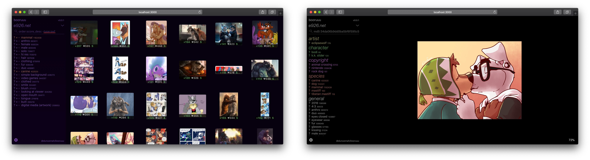

# booruuu - a browser-based imageboard browser

## Warning: This project is a personal project, and is not aimed for general use, although this may change in the future.

This is an imageboard (booru) browser that runs on the browser. Eliminates annoyances that are frequent when using imageboards, such as advertisements, ugly interfaces, intentional throttling, etc...

This is personal project mainly aimed for learning React, but it is possible that it becomes a general-purpose tool if there's enough interest.

This is still in alpha stage, so bugs are pretty common; always except things to not work.

I have beginner-level knowledge in development, thus the code might not be on par with what you might be used to. English is not my mother tongue, so you might also encounter some mistakes in typing.

# How to run

Make sure you ran `npm install` on both the main component and the `client` component to get the dependencies.
You also need nodemon: `sudo npm install -g nodemon`

For general development (runs both server and client): `npm run dev`

Run server only: `PORT=5000 npm run server`

To compile client (to be served by a web server): `cd client; npm run build`

# Currently supported websites

-   e926
-   e621 🔞
-   Danbooru 🔞
-   Sankaku Channel 🔞

# License

This software is licensed under GNU Affero General Public License v3.0. A copy is available [here](LICENSE).
